# Uptime — self-hosted open-source uptime monitor in Node.js

A free, MIT-licensed, **self-hosted uptime monitor** written in Node.js. One Express + EJS app, SQLite (or MySQL), no Docker required (Docker is available if you want it). Built as a simple alternative to Uptime Kuma, Healthchecks.io, Gatus, Statping, and Better Stack.

**Monitor anything**: HTTP/HTTPS endpoints, TCP ports, ICMP ping, DNS records, TLS certificate expiry, **domain WHOIS / RDAP expiry** (catch a forgotten registrar renewal _before_ the domain falls off the internet), **passive heartbeats** for cron jobs and background workers (Healthchecks.io-style with `start`/`success`/`fail` pings, exit codes, cron schedules).

**Notify everywhere**: Discord, Slack, Telegram, Ntfy.sh, Gotify, Pushover, Mattermost, Microsoft Teams, generic webhooks, SMTP email — with fully customizable per-event templates and `{{placeholders}}`.

**Operate at team scale**: public **status page** (90-day strip + Atom RSS feed), token-authenticated REST API, **Prometheus `/metrics` exporter** for Grafana, maintenance windows (cron + one-off), tags and bulk actions, JSON backup / restore, audit log, rate-limited login, **TOTP 2FA per user**, **multi-user with per-monitor ACLs** (admin / editor / viewer + view / manage grants), and configurable data retention.

If you want a **lightweight self-hosted Uptime Kuma alternative** that you can `git clone && npm install && npm start` on any small VPS, this is for you.

[Quick start](#quick-start) · [Features](#features) · [Compared to other uptime monitors](#compared-to-other-uptime-monitors) · [REST API](#rest-api-quickstart) · [Docker](#run-with-docker-optional) · [Production deployment](#production-deployment-pm2--nginx)

---

## Screenshots

**Live dashboard** — compact monitor cards, animated state stripes, live polling every 5s, dark mode by default, full-text search, server-side pagination (52 per page), cert-expiry pill on HTTPS monitors, hover-to-delete inline action.

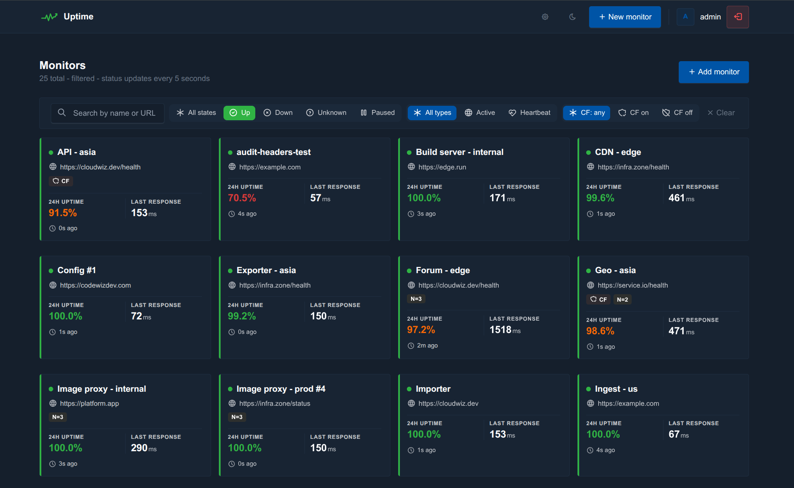

**Filter, search, organise** — filter by state (up / down / unknown / paused), monitor type (HTTP / heartbeat / TCP / ping / DNS / cert / domain), Cloudflare mode, and coloured tags. Every URL parameter is preserved through pagination and bulk actions.

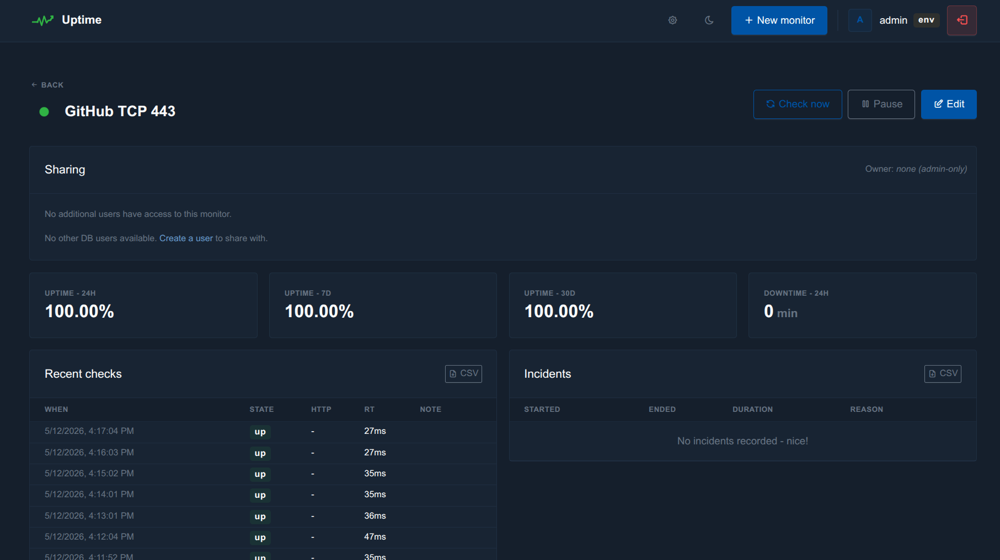

**Bulk actions** — toggle select mode, click cards to multi-select, then **pause / resume / delete / add tag / remove tag** from a sticky bottom action bar.

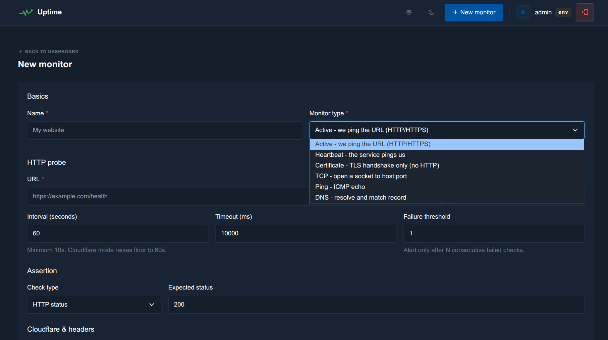

**Add a monitor** — HTTP / TCP / ping / DNS / cert / domain / heartbeat in one form. Status / body-string / JSON-path / regex assertions, optional response-time threshold, per-monitor failure threshold, Cloudflare-aware mode, custom headers, tags, channels, and (for admins) per-monitor ownership.

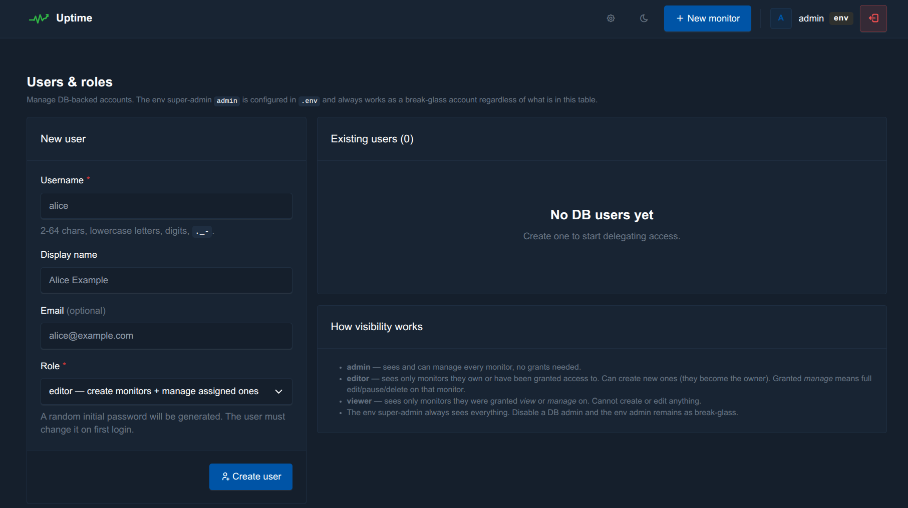

**Advanced probe options** — request body (POST/PUT/PATCH/DELETE with `text` / `json` / `form` types), Basic-auth or Bearer-token authentication, follow-redirects toggle, skip-TLS-verify for self-signed origins, notes, and notification mute.

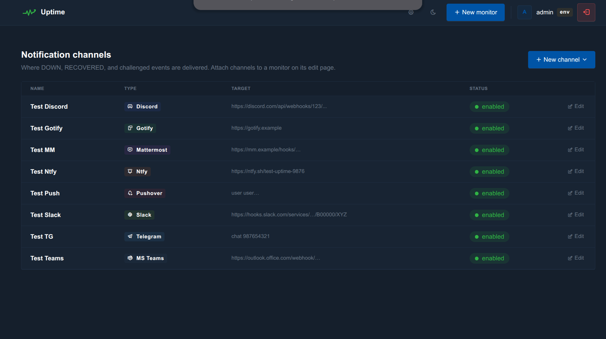

**Monitor detail** — 24h / 7d / 30d uptime %, P95 / min / max / avg response times, **interactive response-time chart** (Chart.js with 24h / 7d / 30d ranges), recent checks log, incident timeline, heartbeat ping log, and (when present) per-monitor sharing.

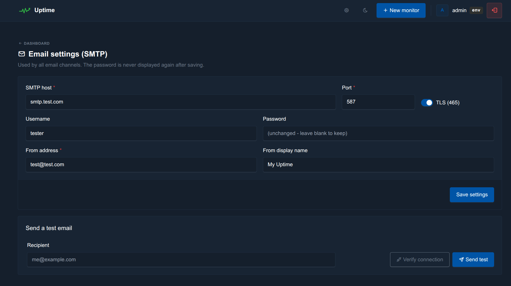

**Per-monitor sharing & incidents** — owners and admins can grant other users `view` or `manage` access on a per-monitor basis. Incident history shows duration, last error, and a `during_maintenance` flag when applicable.

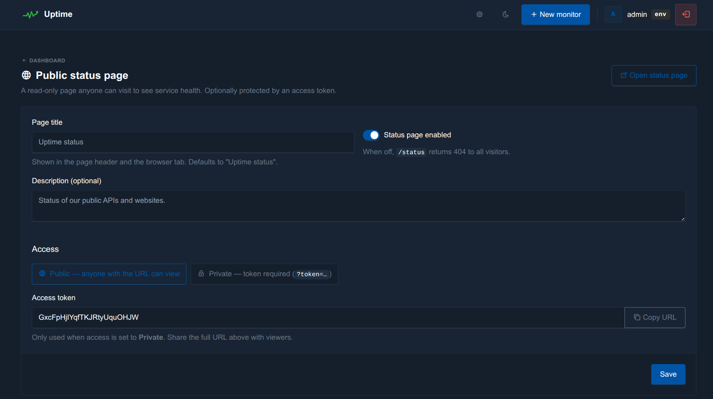

**Notification channels** — 10 channel types (Discord, Slack, Telegram, Ntfy, Gotify, Pushover, Mattermost, MS Teams, email, generic webhook). Attach any combination to any monitor.

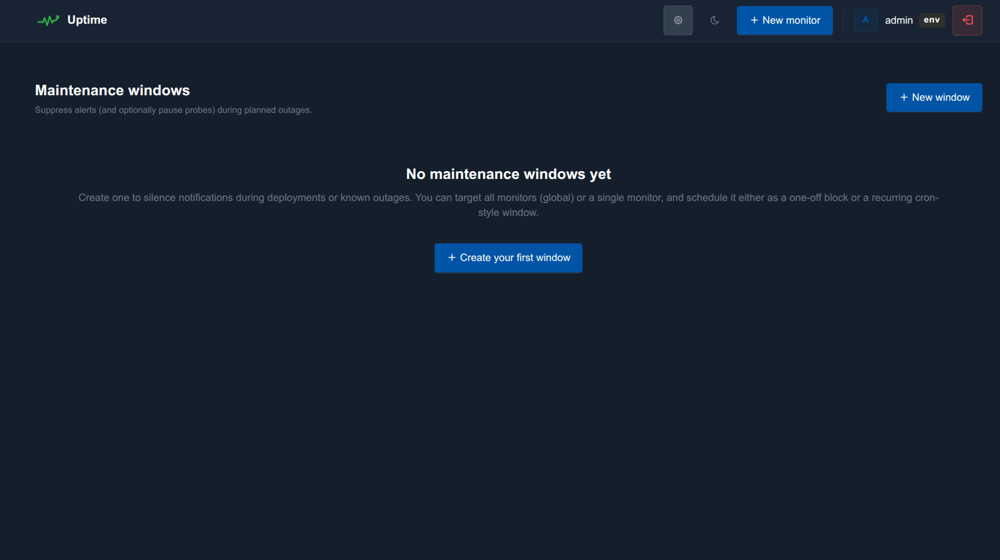

**Customizable templates** — every event (DOWN / RECOVERED / CHALLENGED / CERT_EXPIRING / DOMAIN_EXPIRING / TEST) has its own title and body with `{{placeholders}}` like `{{site_name}}`, `{{site_url}}`, `{{error}}`, `{{status_code}}`, `{{duration_human}}`, `{{cert_days_remaining}}`, `{{domain}}`, `{{domain_days_remaining}}`, `{{domain_registrar}}`. Click a placeholder to insert it at the cursor, click "reset to default" to start over.

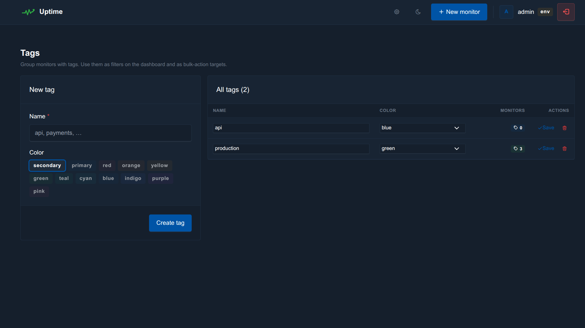

**Backup & restore** — export all (or a selected subset of) monitors, channels, and SMTP settings to a portable JSON file. Restore it on another instance with a configurable conflict strategy (skip / replace / rename). Live preview shows what's in the file before you commit.

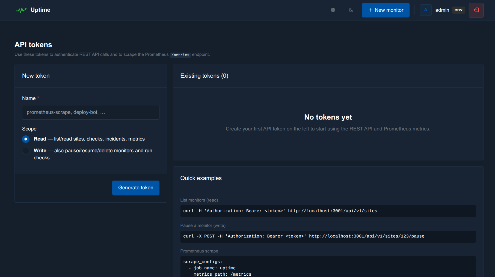

**Public status page** — unauthenticated `/status` route with 90-day daily uptime bars, current state badges, last-24h MTTR, and a `/status.rss` Atom feed. Group monitors into ordered named buckets, override display names per group, hide internal-only monitors with one flag.

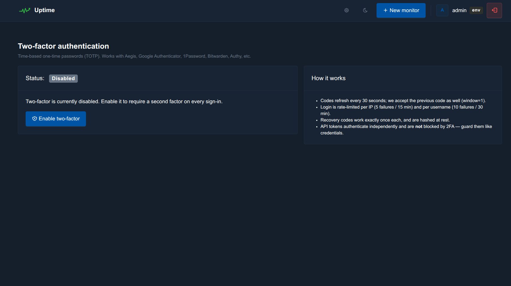

**Multi-user with roles** — flat `admin` / `editor` / `viewer` roles. Admins create users, reset passwords, disable 2FA, and delete accounts; the `.env` super-admin stays as a permanent break-glass account.

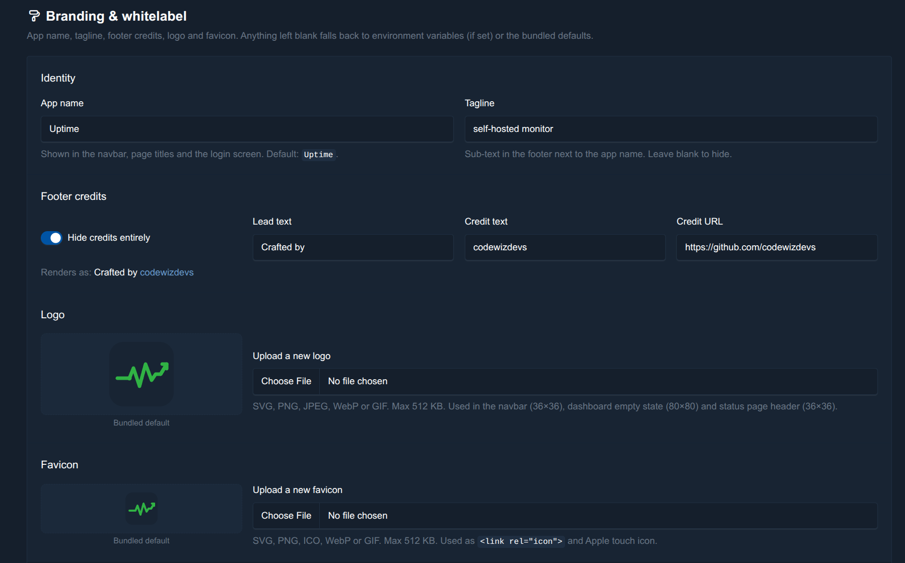

**Per-monitor ACL grants** — pick a user, then set `none` / `view` / `manage` on every monitor with bulk "all view" / "all manage" / "reset" buttons.

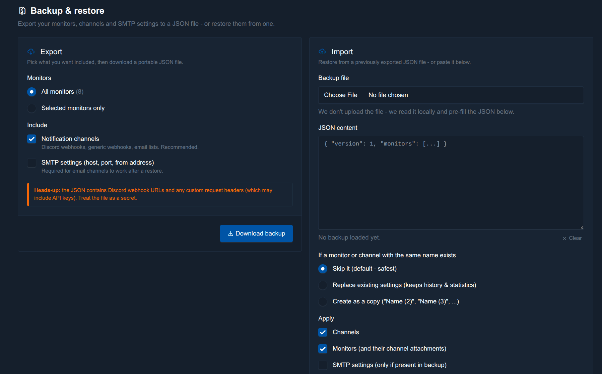

**My account** — every logged-in user manages their own profile, password, **TOTP 2FA** (QR enrolment + 10 single-use recovery codes), and **personal API tokens** from one page.

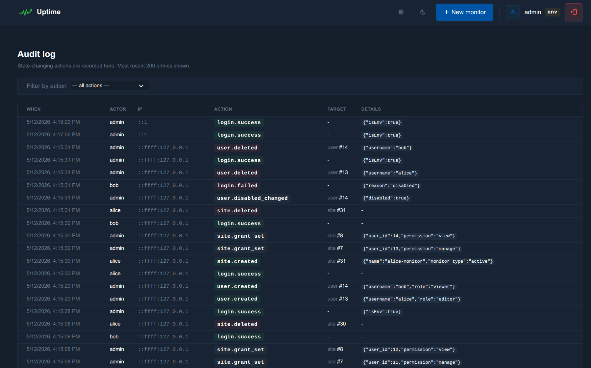

**Audit log** — every state-changing action is recorded with actor (username or `env`), IP, action, target, and structured JSON `meta`. Non-admins only see their own rows.

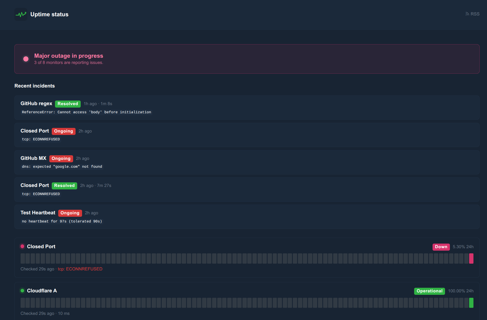

---

## Compared to other uptime monitors

|                              | This project          | Uptime Kuma     | Healthchecks.io  | Gatus           | Statping-ng    | Better Stack    | OneUptime       |
|------------------------------|-----------------------|-----------------|------------------|-----------------|----------------|-----------------|-----------------|
| **License**                  | MIT                   | MIT             | BSD-3            | Apache-2        | Apache-2       | Proprietary     | Apache-2        |
| **Language / runtime**       | Node.js 20+           | Node.js         | Python / Django  | Go              | Go             | SaaS            | Node + Docker swarm |
| **Self-hosted**              | Yes                   | Yes             | Yes              | Yes             | Yes            | No              | Yes (very heavy)|
| **Runs without Docker**      | **Yes (one process)** | Yes             | Yes (with venv)  | Yes             | Yes            | —               | No, needs k8s/swarm |
| **HTTP / HTTPS probes**      | Yes                   | Yes             | No (passive only)| Yes             | Yes            | Yes             | Yes             |
| **TCP / Ping / DNS probes**  | Yes                   | Yes             | No               | Yes             | TCP only       | Yes             | Yes             |
| **TLS cert expiry monitor**  | Yes (dedicated type)  | Yes             | No               | Yes             | No             | Yes             | Yes             |
| **Domain WHOIS / RDAP expiry monitor** | **Yes (dedicated type, RDAP → WHOIS fallback, IANA bootstrap)** | No | No | No | No | Yes (basic) | No |
| **Passive heartbeats (cron)**| Yes (start/success/fail + cron schedule + body capture) | Yes (basic) | **Yes (best in class)** | No | No | Yes | Yes |
| **Cloudflare-aware probing** | **Yes (UA rotation, challenge detection, adaptive backoff)** | No | No | No | No | — | No |
| **Status assertions**        | Status / body-string / JSON path / regex / response-time | Status / keyword | Pass/fail token | YAML conditions | Status / contains | Status / keyword | Status |
| **Notification channels**    | **10** (Discord, Slack, Telegram, Ntfy, Gotify, Pushover, Mattermost, Teams, email, webhook) | 90+ | 30+ | Most via shoutrrr | 13 | 20+ | Many |
| **Per-event message templates** | Yes (`{{placeholders}}`, reset-to-default) | Limited | Yes | Yes | No | Yes | Yes |
| **Public status page**       | Yes (`/status` + RSS, 90-day strip, groups) | Yes | No | Yes | Yes | Yes | Yes |
| **Maintenance windows**      | Yes (cron + one-off, timezone-aware) | Yes | Yes | No | No | Yes | Yes |
| **Tags + bulk actions**      | Yes (coloured tags, multi-select toolbar) | Tags | Limited | No | Tags | Tags | Yes |
| **REST API**                 | Yes (read / write scopes, per-token) | Limited | Yes | Read-only | Yes | Yes | Yes |
| **Prometheus `/metrics`**    | Yes (built-in)        | No (via plugin) | Yes              | Yes             | No             | No              | Yes             |
| **Backup / restore (JSON)**  | Yes (selective, conflict strategy) | Yes | Yes | Config-as-code | Yes | No | Limited |
| **2FA (TOTP) per user**      | Yes (RFC 6238 + recovery codes) | Yes | Yes | No | No | Yes | Yes |
| **Multi-user with RBAC + per-monitor ACLs** | **Yes (admin/editor/viewer + view/manage grants)** | Coming | Teams only | No | Limited | Yes | Yes |
| **Audit log**                | Yes (per actor)       | No              | No               | No              | No             | Yes             | Yes             |
| **Rate-limit + lockout on login** | Yes              | No              | Yes              | No              | No             | Yes             | Yes             |
| **Data retention pruning**   | Yes (per-table, configurable) | Limited | Yes | Stateless | No | Yes | Yes |
| **Configurable failure threshold (anti-flap)** | Yes | Yes | N/A | Yes | No | Yes | Yes |
| **Dark mode**                | Yes (default)         | Yes             | Yes              | No              | No             | Yes             | Yes             |
| **Footprint**                | ~150 MB RAM, single process | ~100 MB | ~200 MB | ~30 MB | ~80 MB | — | **Multi-container, GB-scale** |
| **Optional Docker**          | Yes (one image)       | Yes             | Yes              | Yes             | Yes            | —               | Required        |

**TL;DR** — Uptime Kuma is the obvious comparison. This project picks a different trade-off: fewer notification channels, but **first-class multi-user ACLs**, **Cloudflare-aware probing**, **a built-in Prometheus exporter**, **a real audit log**, and a **single-process, Docker-optional** deployment. If you run on a small VPS behind nginx and want something that looks and feels like Uptime Kuma but with proper team support, this is built for that.

---

## Features

### Monitor types
- **HTTP / HTTPS** — configurable interval, timeout, method, per-monitor request headers.
- **TCP** — raw `net.Socket` connect to host:port with optional banner-substring assertion.
- **Ping (ICMP)** — shells out to the system `ping` (no `CAP_NET_RAW` needed unless containerised); reports avg RTT and partial-loss as failure.
- **DNS** — A / AAAA / CNAME / MX / TXT / NS / SRV / CAA / SOA / PTR via `dns.promises.Resolver` with optional custom resolver and substring / `/regex/` expected-value match.
- **Certificate** — TLS-handshake-only monitor, works for non-443 ports (SMTPS, IMAPS, custom). Tracks days-remaining and fires `cert_expiring` at a per-monitor threshold (default 14 days).
- **Domain (WHOIS / RDAP expiry)** — track the registration expiry of the domain itself, not the TLS cert. The probe tries [RDAP](https://www.rfc-editor.org/rfc/rfc7480) first using the IANA RDAP bootstrap registry (structured JSON, parsed reliably) and falls back to WHOIS over TCP/43 with multi-pattern parsing for diverse registry formats. Stores `expires_at`, `registrar`, EPP `status`, and `days_remaining`. Fires `domain_expiring` at a per-monitor warn-band (default 30 days), with anti-spam bands at 30 / 14 / 7 / 3 / 1 / 0 days so you don't get nagged hourly. Lookups run at most every 12h (server-clamped) and gracefully report `unknown` for redacted / public-suffix domains instead of false-flagging them DOWN. Input is normalised — paste `https://www.example.com/path` and it stores `example.com`.
- **Passive heartbeat (Healthchecks.io-style)** — each monitor has a unique token with four endpoints: `/ping/<token>`, `/ping/<token>/start`, `/ping/<token>/0`, `/ping/<token>/<non-zero>`. Bodies up to 4 KB are captured; exit code and duration are computed across `start`/`success` pairs. Schedules can be **interval+grace** _or_ **cron** in a chosen timezone.

### Assertions (HTTP monitors)
- **Status code** — single (`200`) or comma list (`200,204,301`).
- **Body contains string** — case-sensitive substring match against the auto-decompressed response body.
- **JSON path equals value** — dot-path lookup like `data.status` or `items[0].ok` on the parsed JSON body.
- **Body matches regex** — `pattern` (default `i`) or `/pattern/flags`.
- **Response-time threshold** — flips a passing response to DOWN if it exceeds `max_response_time_ms`.

### Probe controls (per monitor)
- **Failure threshold (anti-flap)** — fire DOWN only after N consecutive failed checks. Default `1`.
- **Request body** — POST / PUT / PATCH / DELETE with `text` / `json` / `form` type — Content-Type set automatically.
- **Authentication** — first-class Basic auth (username / password) or Bearer token.
- **Follow redirects** — 0 or up to 5 hops (`undici` `maxRedirections`).
- **Skip TLS verify** — opt-in `rejectUnauthorized: false` agent for self-signed origins.
- **Mute notifications** — keep probing, suppress channel dispatches (distinct from "pause").
- **Pause / resume** any monitor without losing history.
- **"Check now"** button for instant manual probes.

### Cloudflare-aware probing
- Rotated realistic browser User-Agents and headers (so probes don't look like a bot).
- Automatic Brotli / gzip / deflate response decompression — assertions actually see the decoded body.
- Cloudflare challenge detection (status, `cf-mitigated` header, body markers) → recorded as **inconclusive** (not counted against uptime, no false-positive alerts).
- Optional per-monitor "Cloudflare mode": HEAD-first probe (status checks only), 60s minimum interval, adaptive exponential backoff on consecutive challenges (cap 30 min), one-shot "being challenged" notice after 5 in a row.
- ±5% interval jitter on every monitor so checks don't pile up on the wall clock.

### Notifications
- **Multi-channel fan-out** — attach any number of channels per monitor. Each channel is independently configured.
- **10 channel types**: Discord (rich embeds), Slack, Telegram, Ntfy.sh, Gotify, Pushover, Mattermost, Microsoft Teams (adaptive cards), Email (SMTP), Generic webhook.
- **Custom message templates per event** — DOWN / RECOVERED / CHALLENGED / CERT_EXPIRING / DOMAIN_EXPIRING / TEST each have their own title and body with `{{placeholders}}` like `{{site_name}}`, `{{site_url}}`, `{{error}}`, `{{status_code}}`, `{{duration_human}}`, `{{cert_days_remaining}}`, `{{domain}}`, `{{domain_days_remaining}}`, `{{domain_expires_at}}`, `{{domain_registrar}}`, `{{timestamp}}`. One-click reset-to-default per template.
- **Maintenance windows** suppress alerts globally or per monitor on a cron schedule or one-off range — events still log as `suppressed_by_maintenance`.
- **Test send** button on every channel for instant verification.
- `APP_DEBUG=true` switches every channel into dry-run mode — the would-be payload is logged instead of sent.

### Dashboard & UI
- Tabler-themed dashboard, **dark mode by default** with one-click light/dark toggle.
- Compact monitor cards with status stripe, animated dot, 24h uptime %, last response time, last-checked relative time, **tag chips**, cert-expiry pill on HTTPS monitors, domain-expiry pill on `domain` monitors. 52 per page with server-side pagination.
- **Filter & search bar**: by name/URL, by state (up/down/unknown/paused), by monitor type, by Cloudflare mode, by tag.
- **Bulk actions** — toggle select-mode for per-card checkboxes + a sticky bottom bar to pause / resume / delete / add-tag / remove-tag in one shot.
- **Live updating** — the dashboard polls only the visible monitors every 5s and updates state, response time, and last-checked in place.
- **Per-monitor detail page** with 24h / 7d / 30d uptime %, P95 / min / max response times, response-time chart (Chart.js, 24h / 7d / 30d ranges), recent checks log, incident timeline, heartbeat ping log, and notes block.
- **Active maintenance banner** whenever any window is currently silencing alerts.
- **Delete from listing** — hover any card to reveal an inline trash button with a confirm modal.
- Mobile-responsive — action buttons stack, badges wrap, tested on small screens.

### Public status page
- Unauthenticated **`/status`** route plus **`/status.rss`** Atom feed.
- Ordered named groups with per-monitor display-name override and an "exclude from status page" flag.
- 90-day daily uptime bar per monitor, current state, last 24h MTTR.
- Optional token gate via `STATUS_PAGE_PUBLIC=false` + `STATUS_PAGE_TOKEN`.

### Incident tracking
- Each DOWN → UP transition records an incident with start / end timestamp, duration, and last error message.
- `during_maintenance` flag set on incidents opened inside a window.
- Per-monitor incident table on the detail page (last 25, "ongoing" badge for active incidents).
- **CSV exports** at `/sites/:id/checks.csv`, `/sites/:id/incidents.csv`, and `/incidents.csv` (filtered by ACL for non-admins).

### Tags & organisation
- Coloured tags with inline rename / recolour from a 12-colour Tabler palette.
- Filter the dashboard by tag, add / remove tags on monitors in bulk, multi-select on the monitor form.

### Multi-user with per-monitor ACLs
- **Three flat roles**: `admin`, `editor`, `viewer` — managed at `/settings/users`.
- **Per-monitor grants** layered on top: `view` (read access) or `manage` (read + write). Owners and admins can hand out grants from each monitor's Sharing card; admins can also manage them in bulk from `/settings/users/:id/grants`.
- **Default visibility is strict** — non-admins see only monitors they own or were granted. Admins see everything.
- **`.env` super-admin** stays as a permanent break-glass account, always admin, with its own independent TOTP secret. DB users get their own per-user TOTP.
- **Argon2 password hashing** (`argon2` package).
- **Forced password change** flag set on every freshly-created user.
- **Disable** a user with one click — the next request invalidates their session.
- **Personal API tokens** — every user mints their own tokens from `/settings/account` and tokens inherit the creator's ACL.
- **Claim-unowned button** — new DB admin can take ownership of legacy monitors with one click.

### REST API & metrics
- Bearer-token authenticated REST under `/api/v1/` with `read` / `write` scopes (admins create them at `/settings/api-tokens`; users mint personal ones at `/settings/account`).
- Endpoints: `health`, `sites`, `sites/:id`, `sites/:id/checks`, `sites/:id/incidents`, `incidents`, `tags`, `stats`, plus `pause` / `resume` / `check-now` / `DELETE` on a site.
- Every `/api/v1` response is filtered through the token owner's ACL, so non-admins can only see / act on monitors they have access to.
- **Prometheus exporter** at `/metrics` — series for `uptime_monitor_up`, `uptime_monitor_response_time_ms`, `uptime_monitor_last_check_age_seconds`, `uptime_monitor_uptime_pct_24h`, `uptime_cert_days_remaining`, `uptime_domain_days_remaining` (registered-domain WHOIS / RDAP expiry, emitted for `domain` monitors), `uptime_monitors_total{state}`, `uptime_open_incidents`. Public until the first API token is created; token-gated thereafter and ACL-filtered.
- Tokens stored as SHA-256 with last-used timestamp tracked; the plaintext token is shown exactly once at creation.

### Settings
- **SMTP settings panel** with "Send test email" and "Verify connection". Password never re-displayed.
- **Backup & restore (JSON import / export)** — export all or a selected subset of monitors, channels, and SMTP settings to a portable JSON file. Restore with conflict strategy (skip / replace / rename) and selective per-section import. Live preview shows what's in the file before you commit.
- **Maintenance windows** UI — CRUD, toggle, timezone-aware cron (`cron-parser`) or one-off.
- **API tokens** UI — create / revoke with cURL + Prometheus scrape examples.
- **Users & roles** UI — admin-only, with per-user grants management.
- **My account** UI — profile, password, personal 2FA, personal API tokens.
- **Audit log** UI at `/settings/audit` with action-filter dropdown and JSON meta inline.
- **Whitelabeling** via env vars: custom app name, tagline, logo, favicon, footer text/link, or hide the credit line entirely.

### Security
- Session-based login + optional **TOTP 2FA per user** (RFC 6238, native `crypto`, 10 single-use recovery codes). The `.env` super-admin keeps its own 2FA secret independently.
- **Argon2id** password hashing for all DB users.
- **Multi-user with per-monitor ACLs** — `admin` / `editor` / `viewer` roles + per-monitor `view` / `manage` grants enforced on **every read, write, API, CSV, and Prometheus endpoint**.
- **Login rate-limit & lockout** — 5 failures / 15 min per IP, 10 failures / 30 min per username; a successful login clears both buckets.
- **Audit log** persists login / 2fa / user / api_token / site / tag events with `actor` (username or `env`), `actor_user_id`, IP, and structured `meta`. Non-admins see only their own rows.
- **CSRF-safe POST forms** — every form is same-origin and session-scoped.
- `</script>`-safe JSON serialization for inline `<script>` flash payloads.
- All `:id` route params validated up front (non-numeric IDs return a clean 404 instead of a stack trace).
- Open-redirect-safe `returnTo` after login (only same-origin paths accepted).
- Reverse-proxy aware (`trust proxy`, real client IP from `CF-Connecting-IP` when used).

### Operations
- **SQLite by default** (zero setup, ships idempotent schema) — or **MySQL** by setting `DB_DRIVER=mysql`.
- Schema is applied on boot (`CREATE TABLE IF NOT EXISTS …`) with idempotent column-add migrations — no manual migration step. Tested against both drivers on every release.
- **Configurable retention** — `CHECKS_RETENTION_DAYS` (90), `INCIDENTS_RETENTION_DAYS` (365), `HEARTBEAT_PINGS_RETENTION_DAYS` (30), `AUDIT_RETENTION_DAYS` (180). Daily prune + optional SQLite `VACUUM`.
- Structured logs via `pino`, console + daily-rolling file (`logs/app.log`, 14-day retention, configurable via `APP_DEBUG`).
- Built-in PM2 ecosystem file. Boots cleanly behind nginx / Caddy / Cloudflare.
- **Optional Docker** — multi-stage `Dockerfile` (slim Debian, runs as `node` user) + `docker-compose.yml` with SQLite-by-default and a `mysql` profile for an opt-in MySQL sidecar. Built-in `/healthz` endpoint for container healthchecks.

---

## Quick start

```bash
git clone https://github.com/codewizdevs/uptime.git
cd uptime
npm install
cp .env.example .env
# edit .env (at minimum: SESSION_SECRET, ADMIN_USER, ADMIN_PASS)
npm start
```

Open http://localhost:3000 and sign in with the admin credentials you set in `.env`.

That's it — SQLite is the default, no database server required. The schema auto-applies on first boot.

To enable multi-user mode after first launch, sign in with the env admin, go to **Settings → Users & roles**, click **New user**, and start handing out per-monitor grants.

---

## Configuration

All configuration lives in `.env`. The most important keys:

| Variable | Default | Purpose |
|---|---|---|
| `PORT` | `3000` | HTTP port the app listens on |
| `SESSION_SECRET` | _(unset)_ | **Required.** 32+ random characters used to sign session cookies. Generate with `openssl rand -hex 48`. |
| `ADMIN_USER` / `ADMIN_PASS` | `admin` / `admin` | Env super-admin login (permanent break-glass account). Change before exposing publicly. |
| `APP_DEBUG` | `false` | `true` enables trace logging **and** dry-runs all notification channels (payloads logged instead of sent). |
| `PUBLIC_BASE_URL` | `http://localhost:$PORT` | Public URL used to render heartbeat ping URLs in the UI. |
| `DB_DRIVER` | `sqlite` | `sqlite` or `mysql`. |
| `SQLITE_PATH` | `data/uptime.sqlite` | SQLite file path (relative to project root or absolute). |
| `DB_HOST` / `DB_PORT` / `DB_USER` / `DB_PASSWORD` / `DB_NAME` | — | MySQL connection (only when `DB_DRIVER=mysql`). |

### Whitelabeling

Whitelabeling is managed live from **Settings → Branding & whitelabel** in the app — app name, tagline, logo, favicon, footer credits, and credit-line visibility, all without a restart. Logo and favicon uploads are stored in the database; the URL versions bust browser cache automatically on update.

Older deployments that set `APP_NAME`, `APP_TAGLINE`, `APP_LOGO_PATH`, `APP_FAVICON_PATH`, or `FOOTER_CREDITS_*` in `.env` still work as a fallback when the database value is empty, but the panel is the primary path going forward.

A complete list with comments is in [`.env.example`](./.env.example).

---

## Heartbeat monitors (passive / cron monitoring)

Heartbeat monitors cover cron jobs, background workers, batch ETLs, and internal services that aren't reachable from the outside. Create one in the dashboard, copy the unique ping URL, and have the service hit it on a schedule:

```bash
* * * * * curl -fsS https://your-monitor.example.com/ping/<token> > /dev/null
```

Wrap a long-running job to capture exit code and duration:

```bash
curl -fsS https://your-monitor.example.com/ping/<token>/start
backup_database.sh
curl -fsS https://your-monitor.example.com/ping/<token>/$?
```

If we go more than `interval_seconds + heartbeat_grace_seconds` without a ping (or past the next cron occurrence + grace), the monitor flips DOWN and your channels fire. Bodies up to 4 KB are captured per ping, the last 25 are shown on the detail page.

---

## Production deployment (PM2 + nginx)

The app ships with a PM2 ecosystem file and was designed to run behind nginx (or any reverse proxy).

```bash
# 1. Install
git clone https://github.com/codewizdevs/uptime.git /opt/uptime
cd /opt/uptime
npm install --omit=dev
cp .env.example .env  # edit it

# 2. Run under PM2
npm install -g pm2
pm2 start src/server.js --name uptime
pm2 save
pm2 startup            # run the printed command to enable boot persistence

# 3. nginx vhost (proxy 443 → 127.0.0.1:3000) — example below
```

A minimal nginx vhost looks like this:

```nginx
server {
    listen 443 ssl http2;
    server_name uptime.example.com;
    ssl_certificate     /etc/ssl/uptime/origin.crt;
    ssl_certificate_key /etc/ssl/uptime/origin.key;

    set_real_ip_from 0.0.0.0/0;
    real_ip_header CF-Connecting-IP;
    real_ip_recursive on;

    client_max_body_size 16m;

    location / {
        proxy_pass http://127.0.0.1:3000;
        proxy_http_version 1.1;
        proxy_set_header Host              $host;
        proxy_set_header X-Real-IP         $remote_addr;
        proxy_set_header X-Forwarded-For   $proxy_add_x_forwarded_for;
        proxy_set_header X-Forwarded-Proto https;
    }
}
```

If your edge is Cloudflare, set SSL/TLS mode to **Full** (a self-signed origin cert is fine) — origin terminates TLS, Cloudflare handles the public certificate.

---

## Run with Docker (optional)

Docker isn't required, but a multi-stage `Dockerfile` and a `docker-compose.yml` are committed for users who prefer it.

```bash
cp .env.docker.example .env
# edit .env — at minimum change SESSION_SECRET and ADMIN_PASS

docker compose up -d                  # SQLite, data in the uptime-data volume
# or:
docker compose --profile mysql up -d  # also spin up a mysql:8.4 sidecar
```

The default profile ships only the `uptime` container with SQLite under a named volume. The `mysql` profile adds a `mysql:8.4` service alongside (set `DB_DRIVER=mysql` in `.env` to use it). The app container runs as the unprivileged `node` user, includes `tini` as PID 1, exposes port 3000, and has a built-in healthcheck against the unauthenticated `GET /healthz`.

For the ICMP `ping` monitor type inside the container, compose grants `NET_RAW` to the app service — drop that cap from `cap_add` if you don't need ping monitors.

---

## REST API quickstart

Create a token at `/settings/account → API tokens` (shown exactly once). Then:

```bash
TOKEN=utk_xxxxxxxxxxxxxxxxxxxxxxxxxxxxxxxxxxxxxxxxxxxxxxxx

curl -s -H "Authorization: Bearer $TOKEN" https://uptime.example.com/api/v1/sites | jq
curl -s -H "Authorization: Bearer $TOKEN" https://uptime.example.com/api/v1/sites/123 | jq
curl -s -H "Authorization: Bearer $TOKEN" -X POST https://uptime.example.com/api/v1/sites/123/check-now
```

Tokens inherit the creator's ACL — a viewer's token can only read monitors they have access to, and write actions require both the `write` scope **and** `manage` permission on the target monitor.

Scrape config for Prometheus:

```yaml
- job_name: uptime
  metrics_path: /metrics
  bearer_token: utk_xxxxxxxxxxxxxxxxxxxxxxxxxxxxxxxxxxxxxxxxxxxxxxxx
  static_configs:
    - targets: ['uptime.example.com']
```

---

## Stack

- **Runtime**: Node.js 20+ (native `fetch`-grade libs, brotli / gzip support out of the box)
- **HTTP server**: Express 4 + `express-ejs-layouts`
- **HTTP client (probes)**: `undici` with a shared keep-alive agent
- **DB**: SQLite (`better-sqlite3`) or MySQL (`mysql2/promise`) via a thin abstraction
- **Sessions**: `express-session` (memory store; swap to a persistent store if you cluster)
- **Passwords**: `argon2` (argon2id)
- **Mail**: `nodemailer`
- **Templating**: EJS
- **Frontend**: Tabler CSS (CDN) + vanilla JS (no Bootstrap JS bundle), Chart.js (CDN), Notyf for toasts
- **Logs**: `pino` + `pino-pretty` + `pino-roll` (daily rotation, 14-day retention)
- **No Docker required** — `node`, `npm`, optional `pm2` is all you need.

---

## Project layout

```
src/
  server.js              entry point, middleware order, boot sequence
  config.js              env parsing + branding + retention config
  db.js                  driver loader (sqlite | mysql)
  drivers/sqlite.js      better-sqlite3 + dialect helpers
  drivers/mysql.js       mysql2 pool + dialect helpers
  logger.js              pino + console + rolling file
  monitor.js             scheduler: per-site loops, heartbeat watchdog
  notifier.js            channel dispatch + maintenance/mute short-circuit
  auth.js                session middleware + login helpers + TOTP impl
  routes/
    auth.js              /login, /login/2fa, /logout
    sites.js             dashboard, CRUD, bulk actions, CSV exports, ACL
    channels.js          notification channel CRUD + test send
    settings.js          SMTP, maintenance, api-tokens, users, account, audit
    backup.js            export / import JSON
    branding.js          /branding/logo, /branding/favicon
    ping.js              public /ping/:token[/start|/<code>] endpoints
    tags.js              tags CRUD
    status.js            public /status + /status.rss
    api.js               REST /api/v1/* + /metrics (ACL-filtered)
  lib/
    checker.js           HTTP probe + brotli/gzip decode + assertions
    cert.js              TLS handshake cert inspection
    tcp.js / ping.js / dnscheck.js   non-HTTP monitor types
    whois.js             RDAP (with IANA bootstrap) + WHOIS-over-TCP/43 domain probe
    cloudflare.js        challenge detection, UA pool, jitter
    channels.js          channel data model, dispatch, templates
    templates.js         {{placeholder}} renderer
    email.js             SMTP wrapper, dry-run aware
    backup.js            export/import logic with conflict strategies
    stats.js             uptime % + response-time aggregates + timeseries
    maintenance.js       cron + one-off windows, suppression logic
    tags.js              tag CRUD + site_tags join helpers
    apiTokens.js         token mint/hash/lookup with last-used touch
    audit.js             audit_log persistence + helpers
    rateLimit.js         in-memory IP / username login lockout
    retention.js         scheduled prune + optional VACUUM
    migrations.js        idempotent ALTER/CREATE for sqlite + mysql
    users.js             DB-backed users, argon2 hashing
    acl.js               canSeeSite / canManageSite + Express middleware
    grants.js            per-monitor grant CRUD
    ids.js               :id param validator (clean 404 instead of 500)
    format.js            humanize seconds → "1h 23m 4s"
views/                   EJS templates
public/                  static assets (CSS, JS, images)
sql/
  schema.sqlite.sql      idempotent CREATE TABLEs (auto-applied on boot)
  schema.mysql.sql       same, MySQL syntax
scripts/
  dev-restart.sh         port 3001, SQLite (default dev loop)
  dev-restart-mysql.sh   port 3002, MySQL (compat smoke testing)
  smoke-acl.sh           end-to-end multi-user / ACL smoke test
Dockerfile               multi-stage build (slim Debian, runs as node user)
docker-compose.yml       SQLite default + optional `mysql` profile
.env.docker.example      starter env for compose
PLAN.md                  feature roadmap with shipped/deferred per phase
```

---

## Keywords

self-hosted uptime monitor, open source uptime monitor, Uptime Kuma alternative, Healthchecks.io alternative, Gatus alternative, Statping alternative, Better Stack alternative, Node.js uptime monitor, Express uptime monitor, SQLite uptime monitor, MySQL uptime monitor, free uptime monitor, MIT uptime monitor, website monitor, HTTP monitor, TCP monitor, ICMP ping monitor, DNS monitor, TLS certificate monitor, SSL expiry monitor, domain expiry monitor, WHOIS monitor, RDAP monitor, domain renewal alert, cron monitor, heartbeat monitor, Healthchecks.io self-hosted, Discord notifications, Slack notifications, Telegram notifications, Ntfy notifications, Gotify notifications, Pushover notifications, Mattermost notifications, Microsoft Teams notifications, generic webhook notifications, Prometheus uptime exporter, Grafana uptime dashboard, Cloudflare-aware monitoring, public status page, RSS status feed, maintenance windows, REST API uptime, audit log, TOTP 2FA, per-monitor ACL, multi-user uptime monitor, role-based access control, PM2 nginx deployment.

---

## Roadmap & welcomed PRs

A detailed phase-by-phase changelog of what's shipped lives in [`PLAN.md`](./PLAN.md) — phases 1–13 plus the post-v1 increments (Cloudflare-aware probing hardening, domain WHOIS/RDAP expiry tracking). Forward-looking ideas, all explicitly out of scope for v1 but on the table as opt-in plugins:

- [ ] Multi-region probe fleet (worker mode)
- [ ] On-call schedules and phone-call escalation
- [ ] Multiple assertions per monitor with AND/OR logic
- [ ] SAML / OIDC SSO
- [ ] Groups / teams (per-group ACLs on top of the existing per-monitor grants)
- [ ] More notification channels (PagerDuty, Opsgenie, Zulip, Matrix)

---

## License

[MIT](./LICENSE) — do whatever you want with this. Modify, redistribute, sell, fold into a closed-source product, embed it in a SaaS — no restrictions beyond keeping the copyright notice.

---

## Credits

Built by [codewizdevs](https://github.com/codewizdevs). Issues and pull requests welcome.
